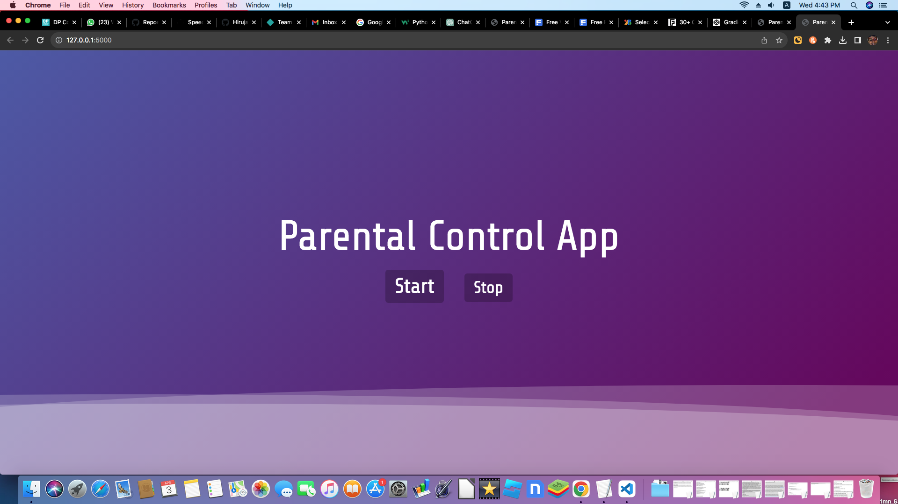
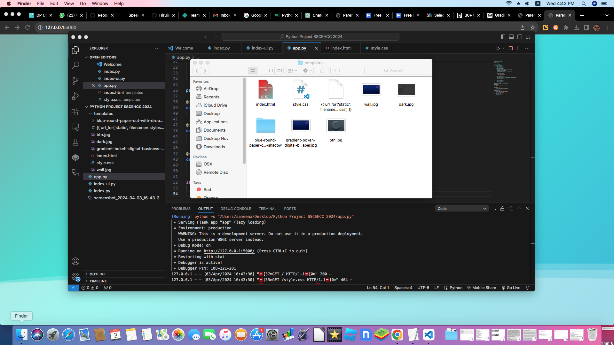

# SSCEHC-Parental Control Application
This is a simple parental control application that can be used to monitor the activities of children using the computer.


## Installation
1. Clone the repository.
2. Install the required packages using the following command:
```bash
pip install -r requirements.txt
```
3. Run the app.py file using the following command:
```bash
python app.py
```
4. Open the browser and go to the following link:
```bash
http://localhost:5000/
```




## Features
1. The application can take periodic screenshots of the screen.
2. The application can use to view the screenshots taken.



## Notes
1. `app.py` is the main python file.
2. `templates/index.html` file is the landing page of the application.
3. Screenshots are stored in the `screenshots\` folder.
4. Changes to the file structure can result in errors in the code.
