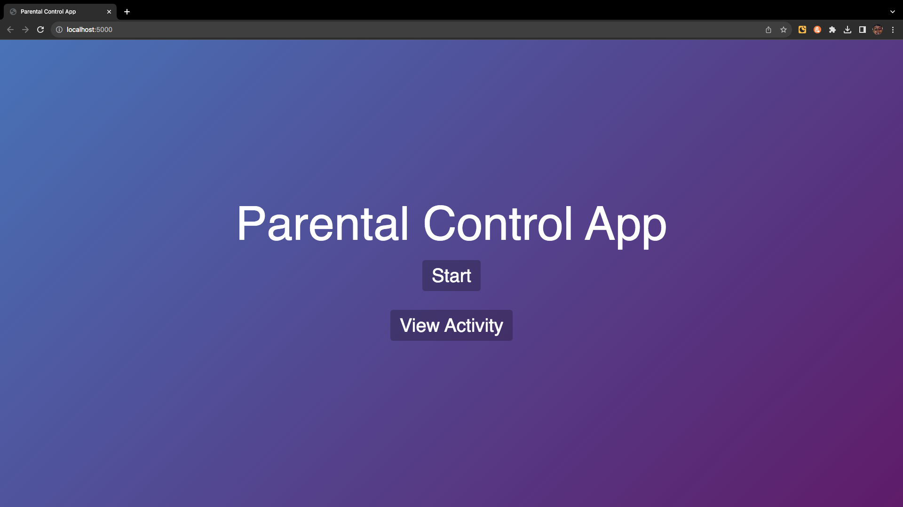
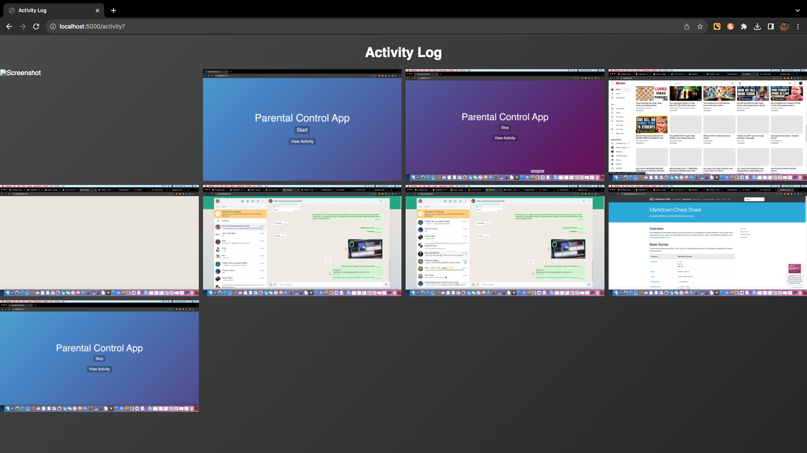

> [!CAUTION]
> Neither the use of the source code/executable nor the idea/concept of this app without strict written permission is authorized. Current and all previous copies, among others, are also non-verbally subjected to this. Engaging in such actions or violating the project's license will result in serious legal consequences. <br><br> &COPY; 2024 Hiruja Edurapola. All rights reserved.

# SSCEHC-Parental Control Application
This is a simple parental control application for monitoring children's computer activities. Created by [Hiruja Edurapola](https://hirujaedurapola.com).

## Table of contents
1. [System Requirements](#system-requirements)
3. [Windows Installation](#windows-installation)
4. [MacOS Installation](#macos-installation)
5. [Python Installation](#python-installation)
2. [Features](#features)
6. [Download](#download)
6. [Notes](#notes)


## System Requirements
|  | Windows | MacOS |
| ----------- | ----------- | -----------  |
| OS | Windows XP or Higher | MacOS Mojave 10.14 or Higher|
| Python Version | `3.6.0` or Higher |  `3.6.0` or Higher |
| Storage | At least `100mb` free |  At least `250mb` free |
| Browser Compatibility  | <ul><li>Internet Explorer 5 or higher.</li><li>Microsoft Bing 2020 or Higher</li><li>Other Browsers Latest Version</li></ul> |  <ul><li>Any Browser Latest Version</li><li>Safari is not supported</li></ul> |
| Ram | `4GB` or Higher (About `500MB` to Run The App*) <br> <br> <p style="font-size: small;">* Depends on the browser and some values may vary. </p>|  `8GB` or Higher (About `700MB` to Run The App)* <br> <br> <p style="font-size: small;">* Depends on the browser and some values may vary. </p> |
| Others | About `20mb` Internet Access is needed. |  About `30mb` Internet Access is needed. |


## Windows Installation
>**Before this, see [Python Installation](#python-installation)**
1. Clone the repository or [Download](#download) the code.

2. Install the required packages using the following command:
```bash
pip install -r requirements.txt
```
3. Run the app.py file using the following command:
```bash
python app.py
```
4. Open the browser and go to the following link:
```bash
http://localhost:5000/
```



## MacOS Installation
>**Before this, see [Python Installation](#python-installation)**
1. Clone the repository or [Download](#download) the code.

2. Install the required packages using the following command:

```bash
pip install -r requirements.txt
```

> [!TIP]
> You might want to enter the file path

```bash
pip install -r /Users/USERNAME/FILEPATH/requirements.txt
```
**Replace `Username` and `File path`  as suitable.**

3. Run the app.py file using the following command:
```bash
python app.py
```
```bash
python /Users/USERNAME/FILEPATH/app.py
```
**Replace `Username` and `File path`  as suitable.**

4. Open the browser and go to the following link:
```bash
http://127.0.0.1:5000/
```
```bash
http://localhost:5000/
```


## Python Installation

### 1. Download and install python from the following url, if you haven't already.
```bash
https://www.python.org/downloads/
```
###  2. Install pip 

- In Windows press `Ctrl + R` then type `cmd` and then press `enter` to open Command Prompt.
- In MacOS press `Cmd + Space` to open spolight and search `Terminal` and open the Terminal

Then enter the following command to install pip

```bash
curl -sSL https://bootstrap.pypa.io/get-pip.py -o get-pip.py
```

### 3. Errors
If you encounter any errors please search the web and find answers. Also make sure that when installing python you selected `Add Python to Environment variables `

<br>

> [!TIP]
> Refer [this](https://stackoverflow.com/questions/17953124/python-is-not-recognized-as-an-internal-or-external-command) stackoverflow thread.

### 4. Back To App Installation
If you have successfully downloaded and installed python and pip, go back to the [installation guide](#windows-installation).


## Features
1. The application can take periodic screenshots of the screen.
2. The application can use to view the screenshots taken.
3. This is useful for busy parents who want to monitor their child's activity.
- Click on the **View Activity** button to see the screenshots
- Screenshots are saved to `screenshots\` folder and can be seen via `templates/activity.html`



## Download

| Version | Windows | MacOS |
| ---------- | ---------- | --------- |
| 3.1.0 | [Download](https://github.com/HirujaEdurapola/SSCEHC-Parental-Control/archive/refs/tags/3.1.0.zip) <br> ```curl -LJO https://github.com/HirujaEdurapola/SSCEHC-Parental-Control/archive/refs/tags/3.1.0.zip``` | [Download](https://github.com/HirujaEdurapola/SSCEHC-Parental-Control/archive/refs/tags/3.1.0.zip) |
| 3.0 Stable Release | [Download](https://github.com/HirujaEdurapola/SSCEHC-Parental-Control/archive/refs/tags/3.0.zip) <br> ```curl -LJO https://github.com/HirujaEdurapola/SSCEHC-Parental-Control/archive/refs/tags/3.0.zip``` | [Download](https://github.com/HirujaEdurapola/SSCEHC-Parental-Control/archive/refs/tags/3.0.zip) |
| 2.0 | [Download](https://github.com/HirujaEdurapola/SSCEHC-Parental-Control/archive/refs/tags/2.0.zip) <br> ```curl -LJO https://github.com/HirujaEdurapola/SSCEHC-Parental-Control/archive/refs/tags/2.0.zip``` | [Download](https://github.com/HirujaEdurapola/SSCEHC-Parental-Control/archive/refs/tags/2.0.zip) |
| 1.0 | [Download](https://github.com/HirujaEdurapola/SSCEHC-Parental-Control/archive/refs/tags/1.0.zip) <br> ```curl -LJO https://github.com/HirujaEdurapola/SSCEHC-Parental-Control/archive/refs/tags/1.0.zip``` | [Download](https://github.com/HirujaEdurapola/SSCEHC-Parental-Control/archive/refs/tags/1.0.zip) |


## Notes
1. `app.py` is the main python file.
2. `templates/index.html` file is the landing page of the application.
3. Screenshots are stored in the `screenshots\` folder.
> [!WARNING]
> File structure changes can result in code errors.


